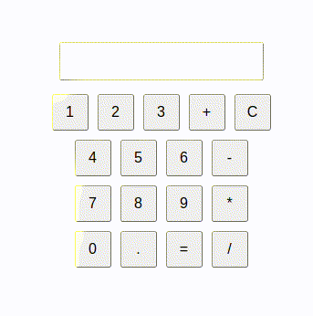
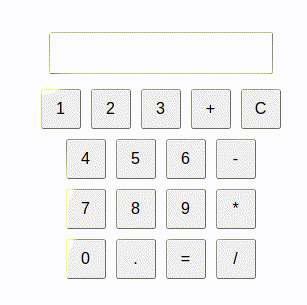
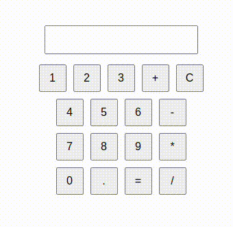
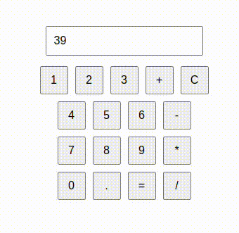

# Calculadora em React

## Implementação

Foi criado um componente para a caluladora. Nesse componente, foram criados os botões necessários para realizar as contas. Foram criados três reducers:

- **Clear input**: usado quando se clica no botão 'C'.
- **Calculate result**: usado para calcular o resultado da expressão e acionado quando se clica em '='.
- **Set input**: acionado quando se clica qualquer outro botão. Adiciona caracteres na expressão.

## Execução

### Adição

### Subtração

### Multiplicação

### Divisão

### Clear

